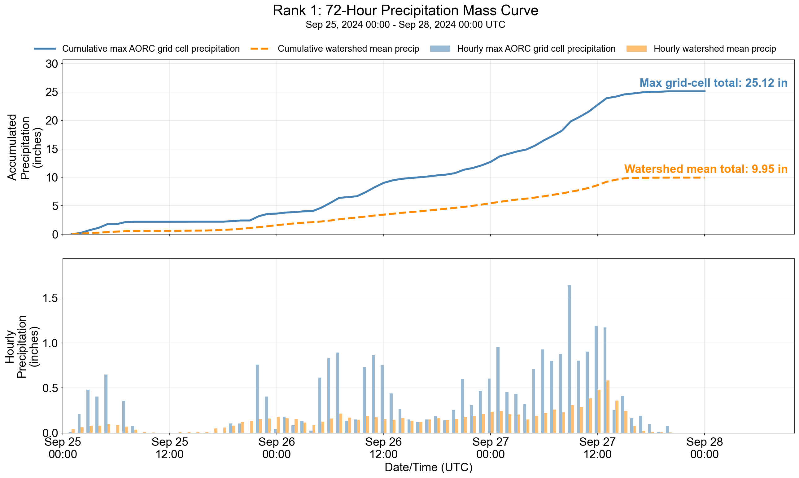

# StormCatalog Mass Curve Generator

This script creates precipitation mass-curve plots for an existing StormCatalog STAC catalog. It reads each storm item JSON, retrieves hourly AORC precipitation for the event window, and calculates:

- cumulative precipitation at the max AORC grid cell
- cumulative watershed-mean precipitation
- hourly precipitation at the same grid cell
- hourly watershed-mean precipitation

The max AORC grid cell is the cell with the largest event-total precipitation. It is fixed for the full event and is not recalculated for each hour.

## Output Modes

The script supports two output modes.

### Separate Results Folder

Set `OUTPUT_DIR` to a results folder and set `REGISTER_ASSETS = False`. All PNGs are saved directly in the output folder:

```text
Storm_Catalog_Mass_Curves/
  rank_001.mass_curve.png
  rank_002.mass_curve.png
  rank_003.mass_curve.png
  mass_curve_run.log
```

The rank number is the StormCatalog item ID. The three-digit filename padding keeps the files in rank order. Process one duration folder per run when using a separate results folder.

This mode does not change the source item JSON files.

### Catalog Asset

Set `OUTPUT_DIR = None` and `REGISTER_ASSETS = True`. Each PNG is saved beside its item JSON and added as the item's `mass_curve` asset:

```text
72hr-events/
  1/
    1.json
    1.mass_curve.png
```

This mode changes the source item JSON files.

## User Inputs

Open `mass_curve.py` and edit the `USER INPUTS` block near the top.

- `CATALOG_DIR`: folder that contains duration folders such as `72hr-events`
- `BASE_WATERSHED_PATH`: base watershed GeoJSON used to create the catalog
- `OUTPUT_DIR`: optional separate folder for generated PNGs
- `REGISTER_ASSETS`: controls whether item JSON files are updated
- `DURATIONS_TO_PROCESS`: duration folder to process
- `REGENERATE_EXISTING`: controls whether finished PNGs are overwritten
- `PROCESS_LIMIT`: optional item limit for a test run
- `NUM_WORKERS`: number of parallel workers
- `BATCH_SIZE`: number of items processed before memory cleanup
- `PLOT_DPI`: PNG resolution in dots per inch

For a separate results folder, use settings like:

```python
CATALOG_DIR = Path(r"C:\project\storm-catalog")
BASE_WATERSHED_PATH = Path(r"C:\project\watershed.geojson")
OUTPUT_DIR = Path(r"C:\project\results\Storm_Catalog_Mass_Curves")
REGISTER_ASSETS = False
DURATIONS_TO_PROCESS = ["72hr-events"]
REGENERATE_EXISTING = False
PROCESS_LIMIT = None
```

Use the same base watershed that was used to create the storm catalog. The script applies the `aorc:transform` values from each item to move this watershed to the storm location.

## Environment Setup

The script needs Python plus the geospatial, plotting, and StormHub libraries. Use the existing `stormhub` conda environment when it is available.

```powershell
conda activate stormhub
python -c "import stormhub, hecdss, geopandas, xarray, rioxarray"
```

If a new environment is required:

```powershell
conda create -n masscurve python=3.11 -y
conda activate masscurve
conda install -c conda-forge geopandas xarray rioxarray pandas matplotlib s3fs zarr shapely -y
```

The local `stormhub` package and `hecdss` must also be available in that environment.

## Run

From the repository root:

```powershell
conda activate stormhub
python meteorology-tools/Scripts/StormCatalog_MassCurve/mass_curve.py
```

The script writes these paths to the run log before processing:

- storm catalog root
- full path for each storm catalog used
- base watershed
- output directory
- duration folder

It then reports the number of generated, skipped, and failed items after each batch. A completed run looks like:

```text
Storm catalog root: C:\project\storm-catalog
Storm catalog used: C:\project\storm-catalog\72hr-events
Base watershed path: C:\project\watershed.geojson
Output directory: C:\project\results\Storm_Catalog_Mass_Curves
Duration folders: 72hr-events
Found 500 items pending mass curve generation
Generated mass curve for item 1 (72hr)
Complete: 500 generated, 0 skipped, 0 failed
```

## Example Mass Curve



This example is Rank 1 from the Upper Tennessee 72-hour catalog. The event starts September 25, 2024 at 00:00 UTC and ends September 28, 2024 at 00:00 UTC. Plot text uses Arial.

The top panel shows accumulated precipitation:

- The solid blue line is the cumulative total at the max AORC grid cell.
- The dashed orange line is the cumulative mean over the transposed watershed.
- The labels at the right show the final event totals.
- A steep segment marks a period when precipitation accumulated quickly.
- A flat segment marks little or no precipitation.

The bottom panel shows hourly precipitation:

- Blue bars show precipitation at the fixed max AORC grid cell.
- Orange bars show the watershed mean for the same hour.
- A group of high bars identifies the main precipitation period.
- A blue bar may be lower than the orange bar in a given hour because the blue location is selected from the full event total, not from that individual hour.

In this example, the max grid-cell total is 25.12 inches and the watershed-mean total is 9.95 inches. The separation between the curves shows that precipitation was concentrated near the max location. The orange curve rises through most of the event, which indicates that the watershed received precipitation over an extended period.

## How to Review a Mass Curve

Use this order for a catalog review:

1. Confirm the rank, event dates, duration, and UTC time zone.
2. Compare the final blue and orange totals with `aorc:statistics.max` and `aorc:statistics.mean` in the item JSON.
3. Find the hours that contribute most of the total.
4. Compare the timing of the blue and orange bars.
5. Review the gap between the cumulative curves.
6. Compare the plot with the precipitation map, storm location, and nearby observations.

The difference between the blue and orange totals describes spatial concentration. A small difference indicates a more uniform precipitation field. A large difference indicates that the max location received more precipitation than the watershed average. Neither pattern is an automatic error.

## Anomaly Checks

Review a rank when one or more of these conditions appears:

- A cumulative line decreases. Cumulative precipitation should stay level or increase.
- The final totals do not match the item JSON statistics within normal rounding.
- The plot has fewer hourly values than the event duration.
- Long gaps appear during a period when the source data or nearby observations show precipitation.
- One blue hourly bar is much larger than all other bars and has little response in the watershed mean.
- The max grid-cell cumulative curve is much larger than the watershed-mean curve for the full event.
- The watershed mean is near zero while the max AORC grid cell receives substantial precipitation.
- The curves stop before the listed event end time.
- Several different ranks have identical bar patterns and totals.

An isolated max-grid-cell spike or a large blue-to-orange difference can represent a real localized storm. Treat it as a review flag. Check the AORC raster, storm footprint, watershed translation, nearby observations, and event metadata before rejecting or changing the event.

## Notes

- The script retrieves AORC data from S3, so network access is required.
- Existing PNGs are overwritten when `REGENERATE_EXISTING = True`.
- With `REGENERATE_EXISTING = False`, the script skips PNGs that already exist in the selected output mode.
- The DSS files in the item folders are not read.
- Use `REGISTER_ASSETS = False` when the source catalog must remain unchanged.
